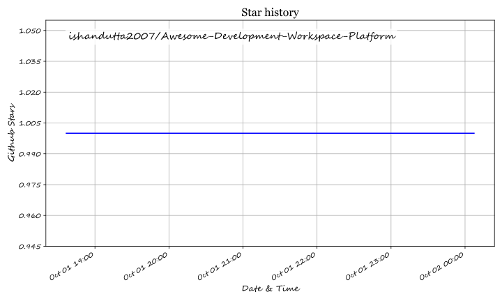

  

# 🚀 Awesome Development Workspace Platform 🛠️

  
  
  
  
  
  

## 🌐 Ecosystem Overview: Cloud Development Environments (CDEs), Workspace Orchestration & DevContainers

> **Curated List of SaaS Products, Cloud IDEs & Open-Source GitHub Projects** 💻✨
> 
> *Focused on Cloud Development Environments (CDE), Workspace Orchestration, DevContainer Standards & Ephemeral AI Sandboxes.*
> 
> **Last updated: October 2026** 📅

This repository tracks top-tier **SaaS platforms**, **cloud-based IDEs**, and **open-source projects** for **Development Workspace Platforms**. These tools empower platform engineers, DevOps leads, and software teams to provision reproducible, standardized, secure, and instant developer environments—ranging from web-based IDEs to ephemeral sandboxes for AI agent code execution. ⚡

---

## 📑 Table of Contents
- [📊 Market Analysis & Overview](#-market-analysis--overview)
- [☁️ SaaS / Hosted Platforms](#%EF%B8%8F-saas--hosted-platforms)
- [🔓 Open-Source GitHub Projects](#-open-source-github-projects)
- [📈 Star History](#-star-history)
- [🤝 How to Contribute](#-how-to-contribute)
- [💖 Support & Sponsorship](#-support--sponsorship)
- [⚠️ Disclaimer](#%EF%B8%8F-disclaimer)

---

## 📊 Market Analysis & Overview

> 💰 **Estimated Market Size**: The global Cloud Development Environment (CDE) and Developer Workspace Platform market is estimated at **$4.2 Billion (2026)**, growing at a CAGR of ~24.5%.
> 
> 🧩 **Market Fragmentation**: The sector is **moderately fragmented**, undergoing a transition toward consolidation by major cloud providers (e.g., GitHub/Microsoft, OpenAI acquisition of Gitpod/Ona, Citrix acquiring Strong Network). However, niche opportunities remain high for specialized open-source engine providers and AI agent execution sandboxes.

---

## ☁️ SaaS / Hosted Platforms

Below is a curated comparison of leading enterprise SaaS and hosted Cloud Development Workspace Platforms, sorted by company valuation and enterprise market capitalization in descending order. 🏆

| SaaS Platform 🛠️ | Company Size / Valuation / Revenue 💎 | Starting Price 💵 | Free Tier / Trial Limits 🎁 | Key Differentiators & Highlights 🌟 |
| :--- | :--- | :--- | :--- | :--- |
| **[GitHub Codespaces](https://github.com/features/codespaces)** 🐙 | **~$3.1 Trillion** *(Parent: Microsoft)* | **$0.18 / core-hour** | **120 core-hours + 15 GB storage free monthly** (Personal Accounts) | Deep integration with GitHub repos, PRs, and workflows; built natively on the `devcontainer.json` standard. |
| **[JetBrains CodeCanvas](https://www.jetbrains.com/codecanvas/)** 🧠 | **~$700M Annual Revenue** *(Private, ~$7B Valuation)* | **$8 per user / month** | **30-day full-feature free trial** (Team workspace provisioning) | Orchestrated CDEs with native JetBrains IDE integration (IntelliJ, PyCharm, WebStorm) & remote backend support. |
| **[Citrix Secure Developer Spaces](https://docs.citrix.com/en-us/secure-developer-spaces)** 🔒 *(formerly Strong Network)* | **~$16.5 Billion** *(Parent: Citrix / CSG)* | **$15 per user / month** | **14-day enterprise trial** (Requires sales contact) | Zero-Trust security architecture preventing code exfiltration; instant browser access without local code storage. |
| **[Gitpod (Ona)](https://ona.com/)** 🤖 *(Acquired by OpenAI)* | **~$400 Million** *(OpenAI Acquisition, $41M Raised)* | **$20 per month** *(Core plan)* | **$10 one-time starter compute credits** | Pivoted to autonomous AI agent orchestration ("task in, pull request out") with web-based VS Code support. |
| **[DevZero](https://www.devzero.io/)** ⚡ | **~$26 Million Total Funding** *(Venture-backed)* | **$5 per CPU / month** | **Free forever plan** (Unlimited clusters, cost & K8s monitoring) | Pivoted to autonomous Kubernetes & AI infrastructure optimization with zero-downtime live checkpointing. |

---

## 🔓 Open-Source GitHub Projects

Development workspace platforms feature a mature, production-grade open-source ecosystem. Below is the list of top open-source projects, sorted strictly by their GitHub Stars_Count in descending order. 🌟

| Project & Repo 📦 | Stars_Count ⭐️ | License 📜 | Ecosystem Role & Category 🎯 | Key Features & Highlights 🚀 |
| :--- | :--- | :--- | :--- | :--- |
| **[code-server](https://github.com/coder/code-server)**   `coder/code-server` |  | `MIT` | Client-Only / Browser IDE | Run VS Code in any browser on a remote server; lightweight Docker setup for individual developers. |
| **[Daytona](https://github.com/daytonaio/daytona)**   `daytonaio/daytona` |  | `AGPL-3.0` | AI Agent Sandbox Engine | Sub-200ms sandbox creation for AI agent code execution; programmatic File, Git, LSP, and Execute APIs. |
| **[Puter](https://github.com/HeyPuter/puter)**   `HeyPuter/puter` |  | `AGPL-3.0` | Desktop & Cloud OS Workspace | Self-hostable internet OS and cloud workspace platform designed for hosting web desktop applications and dev environments. |
| **[Eclipse Theia](https://github.com/eclipse-theia/theia)**   `eclipse-theia/theia` |  | `EPL-2.0` | Cloud IDE Framework | Extensible, vendor-neutral cloud & desktop IDE framework supporting VS Code extensions and protocols. |
| **[Coder](https://github.com/coder/coder)**   `coder/coder` |  | `AGPL-3.0` | Full Self-Hosted CDE | Terraform-based infrastructure-as-code workspace provisioning; RBAC, multi-user SSO, air-gapped enterprise support. |
| **[DevPod](https://github.com/loft-sh/devpod)**   `loft-sh/devpod` |  | `MPL-2.0` | Client-Only DevContainer CLI | Client-only tool provisioning `devcontainer.json` environments across Docker, Kubernetes, AWS, GCP, or SSH VMs. |
| **[Eclipse Che](https://github.com/eclipse-che/che)**   `eclipse-che/che` |  | `EPL-2.0` | K8s-Native Enterprise CDE | Kubernetes-native CDE platform using Devfile standard; powers Red Hat OpenShift Dev Spaces. |
| **[OpenVSCode Server](https://github.com/gitpod-io/openvscode-server)**   `gitpod-io/openvscode-server` |  | `MIT` | Minimal Browser IDE | Lean upstream VS Code distribution for remote browser access with low RAM footprint (~1 GB). |
| **[Flox](https://github.com/flox/flox)**   `flox/flox` |  | `GPL-2.0` | Nix-Powered Env Manager | Deterministic developer environments powered by Nix; 120,000+ packages, SBOM generation, and zero-container portability. |
| **[envd](https://github.com/tensorchord/envd)**   `tensorchord/envd` |  | `Apache-2.0` | MLOps & AI Env Build Tool | Reproducible development environment build tool for AI/ML workloads and Python data science pipelines. |

---

## 📈 Star History

---

## 🤝 How to Contribute

Contributions are warmly welcomed! Help keep this ecosystem guide comprehensive and accurate: 💖

1. 🍴 **Fork** this repository.
2. 📝 **Add or update** entries in `README.md` following the tabular format.
3. 🔎 **Provide accurate details**: Name, starting pricing, free tier limits, Stars_Count, and factual description.
4. 🚀 **Submit a Pull Request** with a clear explanation of your additions.

---

## 💖 Support & Sponsorship

If you found this curated ecosystem list helpful, please consider supporting the project! 🌟

- ⭐ **Star** this repository on GitHub to help others discover it.
- 🔄 **Share** it with fellow platform engineers, DevOps teams, and developers.
- ☕ **Buy me a coffee / Sponsor**: Support ongoing maintenance on the [GitHub Sponsor Dashboard](https://github.com/sponsors/ishandutta2007).

Thank you for being part of the open-source developer experience community! 🙏

---

## ⚠️ Disclaimer

- This is a **community-curated list** — for informational purposes only and not an endorsement.
- Development workspace platforms handle sensitive source code and credentials; ensure appropriate zero-trust security controls and enterprise compliance policies.
- Open-source platforms like **Coder**, **DevPod**, and **Daytona** offer data sovereignty and infrastructure cost savings, while commercial SaaS platforms (e.g. GitHub Codespaces, Ona) provide managed control planes and integrated AI workflows.

## ⭐ Star History

<a href="https://star-history.com/#ishandutta2007/Awesome-Development-Workspace-Platform&Timeline" align="center">
  <picture>
    <source media="(prefers-color-scheme: dark)" srcset="assets/ishandutta2007_Awesome-Development-Workspace-Platform_growth.svg">
    
  </picture>
</a>
